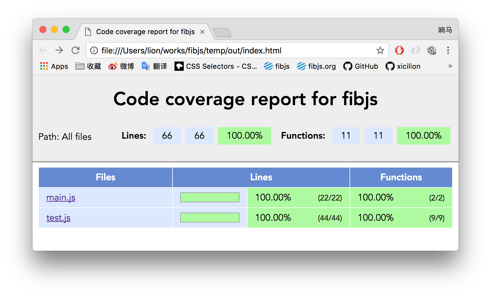

# 美好生活从测试开始
不写自动测试用例的程序员不是一个好的测试工程师。我们鼓励所有的项目在启动最初，就建立完整的自动化测试用例。随着项目的发展，前期的投入会得到数百倍的回报。

我们延续上一小节的例子，来看一下一个如何使用 fibjs 编写测试用例。
```JavaScript
const http = require('http');
const path = require('path');

var hello_server = {
    '/:name(fibjs.*)': (req, name) => {
        req.response.write('hello, ' + name + '. I love you.');
    },
    '/:name': (req, name) => {
        req.response.write('hello, ' + name);
    }
};

var root_server = {
    '/hello': hello_server,
    '/bonjour': hello_server,
    '*': http.fileHandler(path.join(__dirname, 'web'))
};

var svr = new http.Server(8080, root_server);

svr.start();
```

## 一个空的测试框架
我们先从一个最基础的测试框架开始搭建：
```JavaScript
var test = require('test');
test.setup();

describe('hello, test', () => {
    it('a empty test', () => {

    });
});

test.run();
```
保存为 `test.js` 后，在命令行执行 `fibjs test.js`，会看到下面的输出，一个基本的测试框架就写好了。
```sh
  hello, test
    √ a empty test

  √ 1 tests completed (0ms)
```
## 开始测试服务器
因为我们需要测试 http 服务器，所以我们需要先启动服务器。测试用例会向服务器发出请求，然后测试请求结果，来判断服务器是否符合需求：
```JavaScript
var test = require('test');
test.setup();

var http = require('http');

describe('hello, test', () => {
    it('hello, fibjs', () => {
        var r = http.get('http://127.0.0.1:8080/hello/fibjs');
        assert.equal(r.statusCode, 200);
        assert.equal(r.data.toString(), 'hello, fibjs. I love you.');
    });
});

test.run();
```
在这段代码中，我们通过验证 http.get 的结果是否是我们期望的结果，来判断服务器逻辑是否正常。按照这个示例，我们可以很快完成一组测试，我们同时优化了一下代码：
```JavaScript
var test = require('test');
test.setup();

var http = require('http');

function test_get(url, rep) {
    var r = http.get('http://127.0.0.1:8080' + url);
    assert.equal(r.statusCode, 200);
    assert.equal(r.data.toString(), rep);
}

describe('hello, test', () => {
    it('hello, fibjs', () => {
        test_get('/hello/fibjs', 'hello, fibjs. I love you.');
    });

    it('hello, fibjs*', () => {
        test_get('/hello/fibjs-great', 'hello, fibjs-great. I love you.');
    });

    it('hello, JavaScript', () => {
        test_get('/hello/JavaScript', 'hello, JavaScript');
    });

    it('hello, v8', () => {
        test_get('/hello/v8', 'hello, v8');
    });
});

test.run();
```
## 用例的分组管理
下面我们来增加 bonjour 的测试，虽然 bonjour 和 hello 是同一组服务，但是因为路径发生了变化，我们同样需要验证服务的正确性，这一次，为了能更好地管理用例，我们对测试用例进行了分组，同时，因为 hello 和 bonjour 的测试内容是相同的，我们再次优化了代码，用同一套代码测试两组服务：
```JavaScript
var test = require('test');
test.setup();

var http = require('http');

function test_get(url, rep) {
    var r = http.get('http://127.0.0.1:8080' + url);
    assert.equal(r.statusCode, 200);
    assert.equal(r.data.toString(), rep);
}

describe('hello, test', () => {
    function test_hello(hello) {
        describe(hello + ' test', () => {
            it('fibjs', () => {
                test_get('/' + hello + '/fibjs', 'hello, fibjs. I love you.');
            });

            it('fibjs*', () => {
                test_get('/' + hello + '/fibjs-great', 'hello, fibjs-great. I love you.');
            });

            it('JavaScript', () => {
                test_get('/' + hello + '/JavaScript', 'hello, JavaScript');
            });

            it('v8', () => {
                test_get('/' + hello + '/v8', 'hello, v8');
            });
        });
    }

    test_hello('hello');
    test_hello('bonjour');
});

test.run();
```
通过用例分组，我们可以更加清晰地查看测试结果，也可以很方便地跳过和单独测试一组用例，加快开发测试速度。以下是这一轮测试的结果：
```sh
  hello, test
    hello test
      √ fibjs
      √ fibjs*
      √ JavaScript
      √ v8
    bonjour test
      √ fibjs
      √ fibjs*
      √ JavaScript
      √ v8

  √ 8 tests completed (3ms)
```
根据我们的服务器设计，我们还有一组静态文件服务，按照上面的示例，相信你很快可以补写出这部分测试用例。
## 一键测试
经过上面的介绍，我们已经可以很快建立起测试用例了。但是为了使用这个测试脚本，必须先启动服务器，这样很不方便，我们希望运行 `test.js` 能够直接完成测试。我们可以用以下代码来实现：
```JavaScript
var test = require('test');
test.setup();

var http = require('http');

var coroutine = require('coroutine');
coroutine.start(() => {
    run('./main.js');
});
coroutine.sleep(100);

function test_get(url, rep) {
    var r = http.get('http://127.0.0.1:8080' + url);
    assert.equal(r.statusCode, 200);
    assert.equal(r.data.toString(), rep);
}

describe('hello, test', () => {
    function test_hello(hello) {
        describe(hello + ' test', () => {
            it('fibjs', () => {
                test_get('/' + hello + '/fibjs', 'hello, fibjs. I love you.');
            });

            it('fibjs*', () => {
                test_get('/' + hello + '/fibjs-great', 'hello, fibjs-great. I love you.');
            });

            it('JavaScript', () => {
                test_get('/' + hello + '/JavaScript', 'hello, JavaScript');
            });

            it('v8', () => {
                test_get('/' + hello + '/v8', 'hello, v8');
            });
        });
    }

    test_hello('hello');
    test_hello('bonjour');
});

process.exit(test.run());
```
这段代码的第 6~10 行里，我们增加了一段启动 `main.js` 的代码，并且稍微等待一下，之后再开始测试。
## 代码覆盖检查
好的测试用例需要考虑测试用例需要覆盖业务的每一个分支，以确定业务执行正确，此时可以使用代码覆盖检查，来确定测试是否完整。

这个过程很简单，只需要在测试的时候增加 --cov 参数即可：
```sh
fibjs --cov test
```
测试完成后，会在当前目录生成一个 fibjs-xxxx.lcov 的日志文件，此时需要分析日志并生成报告：
```sh
fibjs --cov-process fibjs-xxxx.lcov out
```
便可以在 out 目录生成一组分析报告。进入目录查阅，可以看到以下页面：

可以看到，`main.js` 的代码覆盖达到了 100%，表示测试完全覆盖了业务逻辑。点击 `main.js` 进一步可以看到更详细的报告。

👉 【[找出性能杀手](profiler.md)】